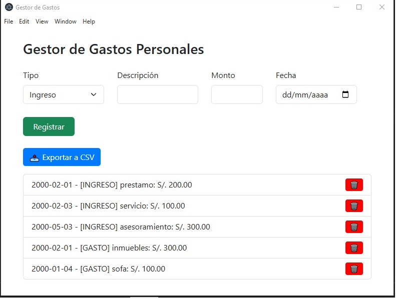
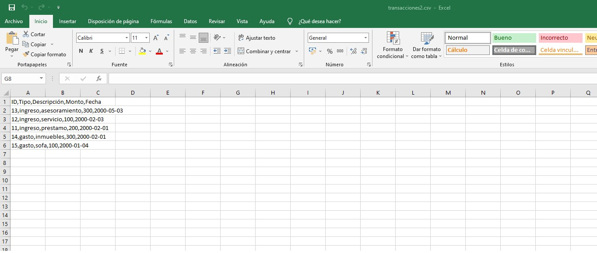

# Gestor de Gastos Personales (Electron)

Aplicación de escritorio para registrar y gestionar gastos e ingresos personales, desarrollada con Electron, SQLite y Bootstrap.

## Características

- Registrar ingresos y gastos con descripción, monto y fecha.
- Mostrar lista de transacciones con opción para eliminar.
- Exportar historial a archivo CSV para uso externo.
- Interfaz moderna con Bootstrap.
- Base de datos SQLite para almacenamiento local.

## Tecnologías usadas

- [Electron](https://www.electronjs.org/)
- [SQLite3](https://www.sqlite.org/index.html)
- [Bootstrap 5](https://getbootstrap.com/)
- JavaScript, HTML y CSS

- 



## Cómo usar

1. Clonar el repositorio:
   ```bash
   git clone https://github.com/tu_usuario/gestor-gastos-electron.git
   cd gestor-gastos-electron

2. Instalar dependencias:
npm install

3. Ejecutar la aplicación:
npm start

Estructura de carpetas

    main.js: código principal del proceso principal de Electron.

    renderer.js: código del proceso de renderizado (interfaz).

    index.html: plantilla HTML de la ventana.

    style.css: estilos personalizados.

    node_modules/: dependencias de Node.js.

    .gitignore: archivos y carpetas ignoradas por Git.


